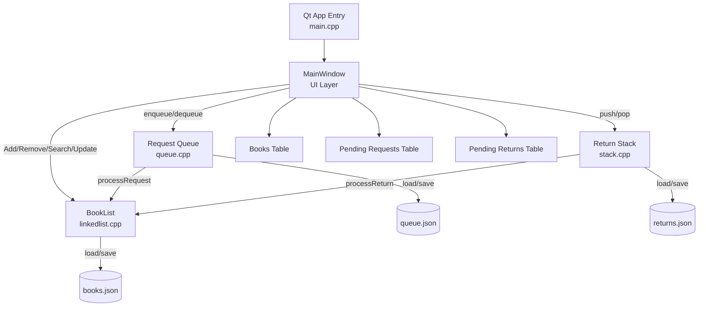
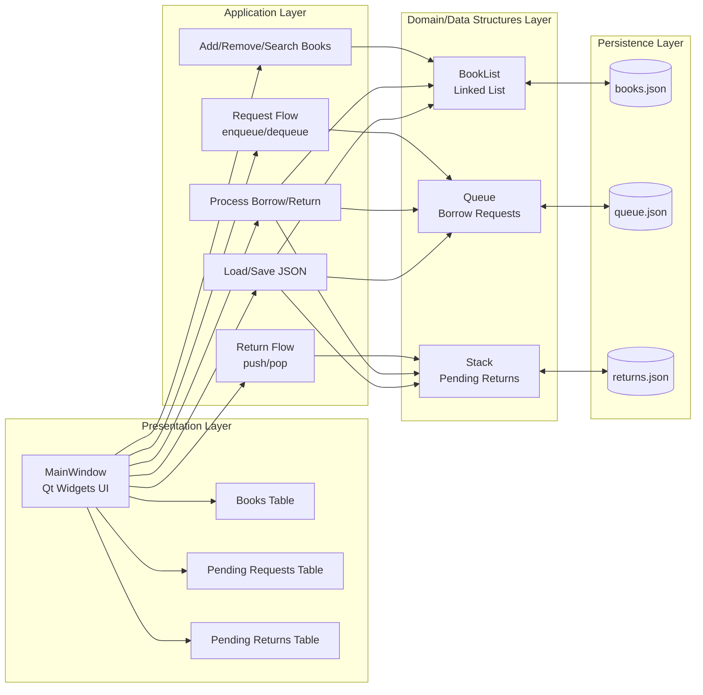

# مشروع نظام إدارة مكتبة (Qt Widgets)

تطبيق سطح مكتب بلغة C++ باستخدام Qt Widgets لإدارة مكتبة بسيطة: حفظ الكتب، إدارة طلبات الاستعارة (Queue)، وإدارة الإرجاع (Stack). الواجهة تتصل مباشرة بهياكل البيانات الموجودة ولا تعيد كتابة منطق الأعمال.

**المكونات الأساسية:**
- `BookList` في [linkedlist.h](linkedlist.h) و[linkedlist.cpp](linkedlist.cpp) — إدارة الكتب (إضافة، حذف، تحديث التوفر، استرجاع جميع الكتب).
- `Queue` في [queue.h](queue.h) و[queue.cpp](queue.cpp) — إدارة طلبات الاستعارة (enqueue, dequeue, getPendingRequests).
- `Stack` في [stack.h](stack.h) و[stack.cpp](stack.cpp) — إدارة عناصر الإرجاع (push, pop, getPendingReturns).
- واجهة المستخدم: [MainWindow.h](MainWindow.h) و[MainWindow.cpp](MainWindow.cpp).
- نقطة الدخول: [main.cpp](main.cpp).
- ملفات البناء: [LibraryManagementSystem.pro](LibraryManagementSystem.pro) (qmake) و[CMakeLists.txt](CMakeLists.txt) (CMake).

**الهدف:**
- واجهة تمكن المستخدم من إضافة كتب، طلب استعارة، تسجيل إرجاع، ومعالجة الطلبات والمرجعات.
- الحفاظ على منطق البيانات في الملفات الموجودة (linkedlist/queue/stack) — الواجهة تستدعي فقط واجهات هذه الهياكل.

## Architecture Diagram



## System Architecture



**ملخص المعمارية:**
- طبقة العرض (`MainWindow`) مسؤولة عن التفاعل مع المستخدم فقط.
- طبقة التطبيق تنفذ حالات الاستخدام (إضافة، طلب، إرجاع، معالجة، حفظ/تحميل).
- طبقة البيانات تعتمد على هياكل البيانات الموجودة: `BookList`, `Queue`, `Stack`.
- طبقة الحفظ مسؤولة عن حفظ واستعادة الحالة من ملفات JSON.

**الميزات الحالية:**
- إضافة كتاب جديد عبر الحقول (Book ID, Title, Author).
- عرض جميع الكتب من `BookList` في جدول.
- إضافة طلب استعارة في الـ `Queue` وظهوره في جدول "Pending Requests".
- إضافة إرجاع في الـ `Stack` وظهوره في جدول "Pending Returns".
- معالجة الطلبات (تفريغ الطابور وتحديث حالة الكتب) ومعالجة المرجعات (تفريغ المكدس وتحديث الحالة).
- حفظ/استرجاع حالة الكتب والطلبات والمرجعات إلى/من ملفات JSON عند الإغلاق والتشغيل.

**حفظ البيانات (Persistence):**
- `books.json` — جميع الكتب وحالتها (موجود في جذر المشروع بعد تشغيل/حفظ التطبيق).
- `queue.json` — قائمة الطلبات المعلقة.
- `returns.json` — محتوى مكدس المرجعات المعلقة.

الملفات السابقة تُخزَّن في جذر المشروع (أي نفس المجلد الذي يحتوي الملفات المصدرية) حتى يسهل العثور عليها ومشاركتها.

**كيفية العمل مع الملفات:**
- عند تشغيل التطبيق، تُقرأ هذه الملفات (إن وُجدت) وتُستعاد حالة `BookList`, `Queue`, و`Stack`.
- عند إغلاق التطبيق أو عند عمليات مهمة، تُحفظ الحالة إلى نفس الملفات بصيغة JSON.

**بناء المشروع (Development):**

المتطلبات:
- Qt 6.6.3 (المشروع مهيأ للعمل مع Qt6، MinGW موصى به على ويندوز).
- MinGW (g++) متوافق مع نسخة Qt المثبتة.
- أدوات Qt: `qmake`، `moc`، ويفضّل `windeployqt` لنشر الـ DLLs للتشغيل خارج بيئة التطوير.

بناء عبر qmake (مجرّد مثال على ويندوز PowerShell):

```powershell
& "C:/Users/Dell/Qt/6.6.3/mingw_64/bin/qmake.exe" LibraryManagementSystem.pro
mingw32-make
```

أو باستخدام CMake:

```powershell
mkdir build
cd build
cmake .. -G "MinGW Makefiles"
mingw32-make
```

بعد البناء ستُنتج الملفات التنفيذية داخل مجلد `build` أو حسب إعدادات مشاريع Qt Creator.

لتشغيل خارج بيئة Qt Creator على ويندوز يجب نشر مكتبات Qt بجانب التنفيذية؛ يمكن استخدام `windeployqt`:

```powershell
& "C:/Users/Dell/Qt/6.6.3/mingw_64/bin/windeployqt.exe" --release --dir .\build .\build\LibraryManagementSystem.exe
```

**تشغيل سريع:**
- يوجد ملف `run.bat` في جذر المشروع لتشغيل النسخة ضمن مجلد `build` بسرعة.

مثال:

```powershell
cd "C:\Users\Dell\OneDrive\Desktop\Data Project"
.\run.bat
```

**ملاحظات هامة للمطورين:**
- لا تقم بإعادة كتابة منطق الأعمال الموجود في `linkedlist.cpp`, `queue.cpp`, و`stack.cpp`. الواجهة (`MainWindow`) يجب أن تستدعي فقط واجهات هذه الهياكل (`addBook()`, `removeBook()`, `getAllBooks()`, `enqueue()`, `dequeue()`, `push()`, `pop()`, `getPendingRequests()`, `getPendingReturns()`, `processRequest()`, `processReturn()`).
- عند استعادة المكدس من `returns.json` نحافظ على الترتيب الأصلي: يُخزَّن المكدس كصفيف من الأعلى إلى الأسفل، وعند إعادة البناء نضع العناصر بترتيب عكسي لاستعادة نفس ترتيب الـ `pop()` لاحقًا.
- عند استعادة الطابور من `queue.json` تُعاد عناصر الطابور بالترتيب الصحيح عبر `enqueue()`.

**مكان البحث عن الأخطاء وتشغيل التطبيق:**
- إذا ظهرت أخطاء مرتبطة بـ `moc`، تأكد من تشغيل `moc` على ملف الرأس `MainWindow.h` ومن تجميع `moc_MainWindow.cpp` مع بقية الملفات.
- إذا ظهرت رسائل عند التشغيل تفيد بفقدان ملفات DLL خاصة بـ Qt، استعمل `windeployqt` لنشر المكتبات المطلوبة.

**اقتراحات مستقبلية:**
- إضافة ميزة تصدير/استيراد قاعدة البيانات بصيغة واحدة (مثلاً ملف JSON مركزي) بدلاً من ثلاث ملفات منفصلة.
- إضافة صفحات إدارة مستخدمين وصلاحيات.
- إضافة اختبار آلي للوحدات للتحقق من استعادة الحالة وسيناريوهات التزامن على الطابور/المكدس.

**ملفات مهمة للمراجعة بسرعة:**
- [MainWindow.cpp](MainWindow.cpp) — واجهة المستخدم وربط العمليات.
- [linkedlist.cpp](linkedlist.cpp) — منطق الكتب.
- [queue.cpp](queue.cpp) — منطق الطابور.
- [stack.cpp](stack.cpp) — منطق المكدس.
- [run.bat](run.bat) — سكربت تشغيل سريع.

---


