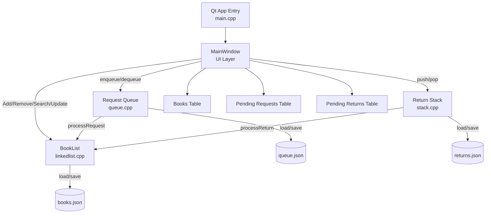
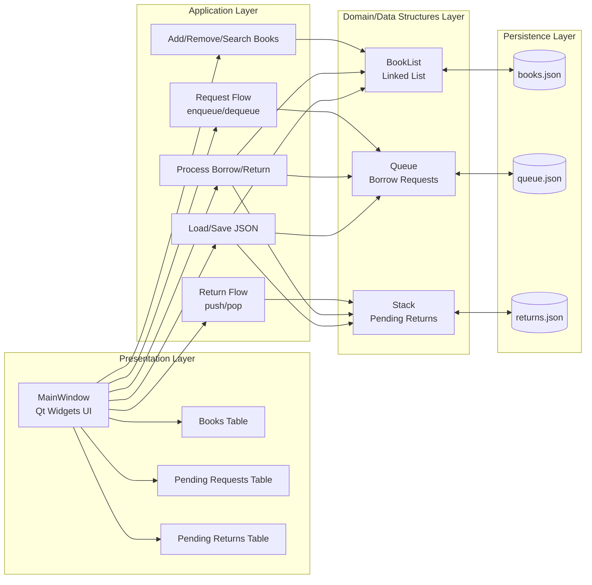

# Library Management System Project (Qt Widgets)

A C++ desktop application built with Qt Widgets for managing a simple library: book storage, borrowing requests (Queue), and returns (Stack). The UI connects directly to the existing data structures and does not reimplement business logic.

**Core Components:**
- `BookList` in [linkedlist.h](linkedlist.h) and [linkedlist.cpp](linkedlist.cpp) — book management (add, delete, update availability, retrieve all books).
- `Queue` in [queue.h](queue.h) and [queue.cpp](queue.cpp) — borrowing request management (enqueue, dequeue, getPendingRequests).
- `Stack` in [stack.h](stack.h) and [stack.cpp](stack.cpp) — return item management (push, pop, getPendingReturns).
- User interface: [MainWindow.h](MainWindow.h) and [MainWindow.cpp](MainWindow.cpp).
- Entry point: [main.cpp](main.cpp).
- Build files: [LibraryManagementSystem.pro](LibraryManagementSystem.pro) (qmake) and [CMakeLists.txt](CMakeLists.txt) (CMake).

**Goal:**
- Provide an interface that lets the user add books, request borrowing, register returns, and process requests and returns.
- Keep the data logic in the existing files (linkedlist/queue/stack) — the UI only calls the interfaces of these structures.

## Architecture Diagram



## System Architecture



**Architecture Summary:**
- The presentation layer (`MainWindow`) is responsible only for user interaction.
- The application layer implements the use cases (add, request, return, process, save/load).
- The data layer depends on the existing data structures: `BookList`, `Queue`, and `Stack`.
- The persistence layer is responsible for saving and restoring state from JSON files.

**Current Features:**
- Add a new book using fields (Book ID, Title, Author).
- Display all books from `BookList` in a table.
- Add a borrowing request to the `Queue` and show it in the "Pending Requests" table.
- Add a return item to the `Stack` and show it in the "Pending Returns" table.
- Process requests (empty the queue and update book status) and process returns (empty the stack and update status).
- Save and restore the state of books, requests, and returns to and from JSON files on exit and startup.

**Data Persistence:**
- `books.json` — all books and their status (stored in the project root after running/saving the app).
- `queue.json` — the list of pending requests.
- `returns.json` — the contents of the pending returns stack.

These files are stored in the project root (the same folder that contains the source files) so they are easy to find and share.

**Working with Files:**
- When the application starts, these files are read if they exist, and the state of `BookList`, `Queue`, and `Stack` is restored.
- When the application closes or important operations occur, the state is saved back to the same files in JSON format.

**Building the Project (Development):**

Requirements:
- Qt 6.6.3 (the project is configured for Qt 6; MinGW is recommended on Windows).
- MinGW (g++) compatible with the installed Qt version.
- Qt tools: `qmake`, `moc`, and preferably `windeployqt` to deploy DLLs for running outside the development environment.

Build with qmake (example on Windows PowerShell):

```powershell
& "C:/Users/Dell/Qt/6.6.3/mingw_64/bin/qmake.exe" LibraryManagementSystem.pro
mingw32-make
```

Or using CMake:

```powershell
mkdir build
cd build
cmake .. -G "MinGW Makefiles"
mingw32-make
```

After building, the executable files will be generated inside the `build` folder or according to the Qt Creator project settings.

To run outside Qt Creator on Windows, Qt libraries must be deployed alongside the executable; you can use `windeployqt`:

```powershell
& "C:/Users/Dell/Qt/6.6.3/mingw_64/bin/windeployqt.exe" --release --dir .\build .\build\LibraryManagementSystem.exe
```

**Quick Run:**
- A `run.bat` file is available in the project root to quickly run the build inside the `build` folder.

Example:

```powershell
cd "C:\Users\Dell\OneDrive\Desktop\Data Project"
.\run.bat
```

**Important Notes for Developers:**
- Do not rewrite the business logic in `linkedlist.cpp`, `queue.cpp`, and `stack.cpp`. The `MainWindow` UI should only call the interfaces of these structures (`addBook()`, `removeBook()`, `getAllBooks()`, `enqueue()`, `dequeue()`, `push()`, `pop()`, `getPendingRequests()`, `getPendingReturns()`, `processRequest()`, `processReturn()`).
- When restoring the stack from `returns.json`, the original order is preserved: the stack is stored as an array from top to bottom, and when rebuilding it we insert elements in reverse order to preserve the same later `pop()` order.
- When restoring the queue from `queue.json`, queue items are reinserted in the correct order through `enqueue()`.

**Where to Look for Errors and Run the App:**
- If you see errors related to `moc`, make sure `moc` is run on the `MainWindow.h` header and that `moc_MainWindow.cpp` is compiled with the rest of the files.
- If runtime messages indicate missing Qt DLL files, use `windeployqt` to deploy the required libraries.

**Future Suggestions:**
- Add a single-file import/export feature for the database state (for example, a central JSON file) instead of three separate files.
- Add user and permission management pages.
- Add automated unit tests to verify state restoration and queue/stack synchronization scenarios.

**Files to Review Quickly:**
- [MainWindow.cpp](MainWindow.cpp) — user interface and operation wiring.
- [linkedlist.cpp](linkedlist.cpp) — book logic.
- [queue.cpp](queue.cpp) — queue logic.
- [stack.cpp](stack.cpp) — stack logic.
- [run.bat](run.bat) — quick run script.

---


